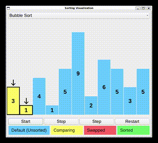

# SortVisualizer



This project provides a visual demonstration of sorting algorithms, starting with the Bubble Sort algorithm. The application visually shows the process of sorting a list of numbers, highlighting comparisons, swaps, and the final sorted state.

## Features

- **Bubble Sort Algorithm**: Displays the sorting process in real-time, with color-coded steps to differentiate the various stages of sorting.
- **Interactive Controls**:
  - Start, Stop, Step through the sorting process.
  - Restart the visualization at any time.
- **Color-coded Status**:
  - Yellow: Default (Unsorted)
  - Blue: Comparing two elements
  - Red: Swapped elements
  - Green: Sorted

## Installation

To run the project locally, follow these steps:

1. Clone the repository:
   ```bash
   git clone https://github.com/sminerport/SortVisualizer.git
   ```

2. Navigate to the project directory:
   ```bash
   cd SortVisualizer
   ```

3. Ensure you have Python installed. You may also need to install some dependencies:
   ```bash
   pip install -r requirements.txt
   ```

4. Run the visualization:
   ```bash
   python main.py
   ```

## Usage

- **Start**: Begins the sorting process.
- **Step**: Manually advance the sorting one step at a time.
- **Stop**: Pauses the sorting process.
- **Restart**: Resets the list and restarts the process.

## Algorithms

Currently, the visualization supports the **Bubble Sort** algorithm. More sorting algorithms (like QuickSort, MergeSort, etc.) may be added in the future.

## Demo

Check out the demo of the Bubble Sort in action:


## Contribution

Contributions are welcome! If you have suggestions for improvements or want to add new features, feel free to open a pull request or issue.